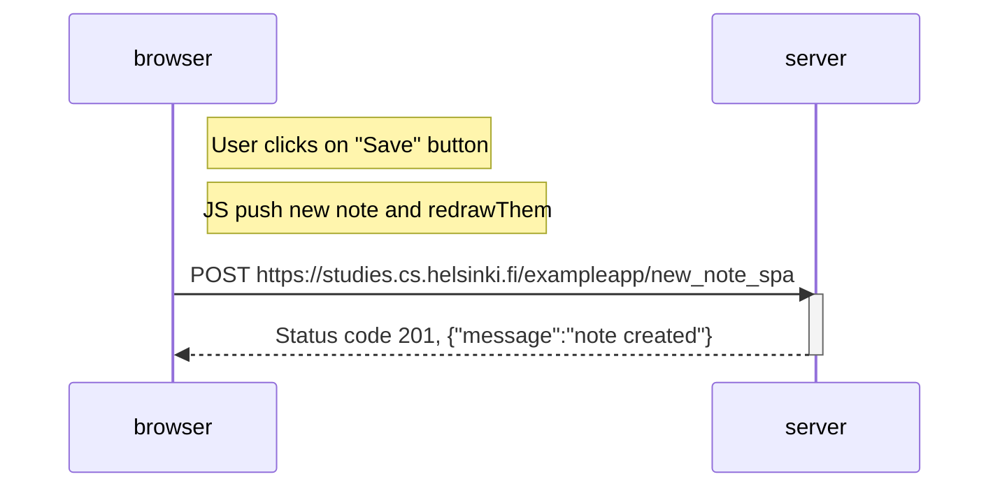

```mermaid
sequenceDiagram
  participant browser
  participant server

  Note right of browser: User clicks on "Save" button

  Note right of browser: JS push new note and redrawThem

  browser->>server: POST https://studies.cs.helsinki.fi/exampleapp/new_note_spa
  activate server
  server-->>browser: Status code 201, {"message":"note created"}
  deactivate server
```
